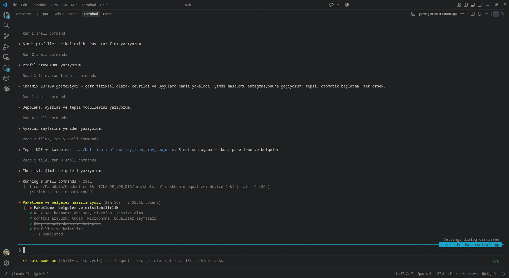
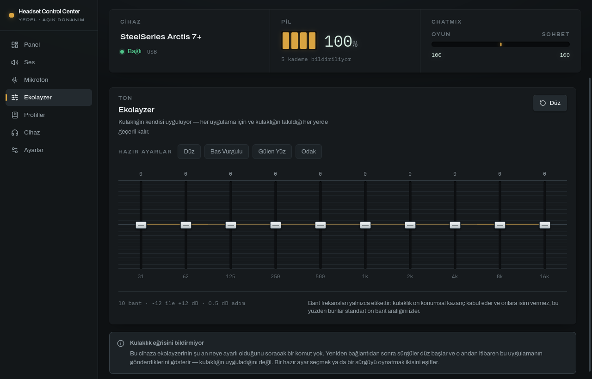
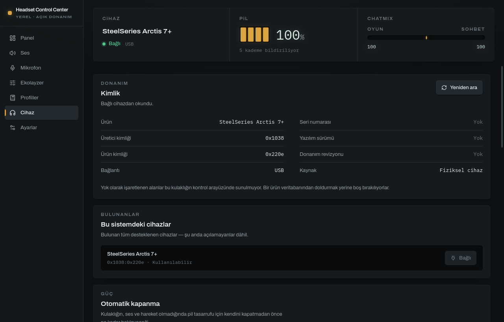

# Gear Control Center

[](LICENSE)
[](#requirements)

A desktop control panel for USB gaming headsets and mice on Linux. Tauri v2 and
React in front, Rust and hidapi behind.

It is local software: no account, no telemetry, no network access. It talks to
your devices over USB and to nothing else.



## Why this exists

The vendor software for these devices is Windows-only, and the Linux
alternatives are command-line tools. This is a full control panel — built on
one rule the vendor software does not follow:

> **A control exists only if it reaches the device.**

If the device cannot do something, the application says so in the place you
would have looked for it. Nothing is done in software and presented as a
hardware feature, and no button reports success for a command that was never
sent.

Two consequences you can see in the first screenshot:

* **The battery gauge has four segments, not a percentage bar.** This headset
  reports five levels — 0, 25, 50, 75, 100. A smoothly moving percentage would
  be an invention, and a number that sat at exactly 75% for an hour would
  rightly cost you your trust in every other reading on the page.
* **There is no "save to device" button**, because the hardware has no profile
  memory. Profiles are stored by the application and applied by sending each
  setting, and the Profiles page says exactly that.

## Supported hardware

| Device | USB ids | Status |
| ------ | ------- | ------ |
| SteelSeries Arctis 7+ | `1038:220e` | Verified against hardware — full control |
| Arctis 7+ PS5 / Xbox / Destiny | `1038:2212`, `2216`, `2236` | Same protocol, untested |
| SteelSeries Arctis Nova 7 / 7X | 12 ids, `1038:2202` and others | **Read-only**: written from documentation, unconfirmed |
| SteelSeries Aerox 3 Wireless | `1038:1838` (radio), `1878` | Verified against hardware — sensor, report rate, lighting, sleep timer |
| Aerox 3 Wireless on the cable | `1038:183a`, `187a` | **Read-only**: same source, not run with the cable in |
| Simulated device | — | Always available, for development |

A device implemented from documentation reads from your hardware and will not
write to it. Two independent projects agreeing on a protocol is enough to
implement a device; it is not enough to send one a command nobody has ever
seen it answer. If you own one and the readings match what it reports
elsewhere, say so in an issue and the controls are turned on.

A headset and a mouse are held open at the same time, and the sidebar switches
between them. Each keeps its own settings and its own battery reading; a device
that stops answering is let go without disturbing the other.

Other hardware is not supported yet, and will not be added on guesswork — see
[Adding a device](#adding-a-device).

## Install

A binary demands the glibc it was linked against, so the packages are built
against older C libraries than the development machine's rather than on it. The
`.deb` and the AppImage come out of an Ubuntu 22.04 container and run on glibc
2.35 and newer; the `.rpm` out of Fedora 40. The Arch package is the exception
and is built on Arch, where a rolling library set is the point.

### Debian, Ubuntu, Mint, Pop!_OS

```bash
sudo apt install ./gear-control-center_0.5.0_amd64.deb
```

Installs the application, a desktop entry, the icons and the `gearctl`
command. Removing it later is `sudo apt remove gear-control-center`.

### Fedora, RHEL, openSUSE

```bash
sudo dnf install ./gear-control-center-0.5.0-1.x86_64.rpm
```

### AppImage — any distribution

Nothing is installed; the file is the application.

```bash
chmod +x gear-control-center_0.5.0_amd64.AppImage
./gear-control-center_0.5.0_amd64.AppImage
```

### Arch Linux and derivatives

Build it. A `PKGBUILD` lives in [`packaging/aur`](packaging/aur); it builds from
the tagged release and installs the binary, the `gearctl` command, a desktop
entry and the icons:

```bash
git clone https://github.com/debbiedi/gear-control-center.git
cd gear-control-center/packaging/aur
makepkg -si
```

`makepkg -s` pulls the build dependencies (`rust`, `nodejs`, `npm`) and `-i`
installs the finished package, so this is the whole procedure. Removing it
later is `sudo pacman -R gear-control-center`.

Every runtime dependency is in the official repositories — this is the
distribution the application was developed and tested on.

A built `.pkg.tar.zst` is attached to each release for anyone who would rather
not compile. Take it as a convenience rather than the supported path: it links
against the libraries that were current on the day it was built, and Arch moves
those. `makepkg` is the answer that keeps working.

The AUR package is waiting on an account — registration at
[aur.archlinux.org](https://aur.archlinux.org/register) is closed to new users
at the moment. The publishing steps are written up in
[`packaging/aur/README.md`](packaging/aur/README.md) and take about a minute
once it reopens.

### Building the packages yourself

The packages are produced by
[`packaging/linux/build.sh`](packaging/linux/build.sh), which needs only Docker
and a checkout:

```bash
./packaging/linux/build.sh          # deb, AppImage and rpm
./packaging/linux/build.sh ubuntu   # just the deb and the AppImage
```

It copies the tracked files into a temporary tree, so it will not touch a
`node_modules` or `target/` you are working in.

### Requirements

* Linux with glibc 2.35 or newer (Ubuntu 22.04 and later, or any current
  rolling distribution)
* `webkit2gtk` 4.1, GTK 3, and an ALSA-capable sound stack — PipeWire and
  PulseAudio both work, since the application drives the device's own hardware
  mixer rather than a software one
* **No udev rule on a current distribution.** Most ship one that already grants
  the logged-in user access to these HID devices. If yours does not, see
  [docs/hardware.md](docs/hardware.md).
* **No root, ever.** If something asks you for a password to run this, it is
  not this.

## What it does

* Battery level and charging state, at the device's own resolution
* ChatMix dial position, live — and, if you turn it on, two virtual outputs
  ("Headset — Game" and "Headset — Chat") so the dial actually splits game and
  chat audio the way it does on Windows
* Output volume and mute — the headset's own hardware controls, so the change
  applies to every application and survives this one being closed
* Microphone level and mute
* Sidetone, four hardware steps
* Ten-band equaliser applied inside the headset, plus its four firmware presets
* Auto shut-off timer
* Those three sent again whenever the headset comes on. It does not report
  them back, so what you set is kept here and re-sent — after a restart, a
  power cycle, a replug — rather than assumed to have survived
* Profiles, stored locally and applied setting by setting

For a mouse:

* Up to five resolution presets, snapped to the steps the sensor actually has
  and reported back snapped — the window never shows a figure the mouse is not
  set to
* Report rate, 125 to 1000 Hz
* Per-zone lighting with a rainbow effect, a colour flashed on click, and a dim
  timer
* Sleep timer, the same control a headset's auto shut-off uses
* Saving all of it to the mouse's own memory, on a button rather than on every
  drag — that writes to flash

A headset and a mouse are held open together, each with its own battery reading
and its own record of what it was sent.

* System tray with battery and both mutes, start with the system, low battery
  warning
* A diagnostics report for bug reports
* An interface in English, German, Spanish, French and Turkish, following the
  desktop's language by default

<p align="center">
  
  
</p>

### What it deliberately does not do

No firmware updating (there is no documented update path, and a firmware writer
built on guesswork is how hardware dies). No microphone noise reduction, gate
or compressor — doing that in software and calling it a device feature would be
a lie. No volume limiter. No button remapping yet, though the mouse documents a
command for it. Profiles cover a headset's settings and not a mouse's, so the
Profiles section is hidden while a mouse is selected rather than shown half
working.

RGB is driven where the hardware has it — the Aerox has three zones, the Arctis
has none, and each device says which it is.

Each of these appears in the application marked as unsupported, rather than
being quietly missing.

## From the shell

`gearctl` reads the same device layer the window does. Only one process can
hold a device's control interface, so it asks a running window over a local
socket when there is one and opens the device itself when there is not — you do
not have to know which.

```console
$ gearctl
SteelSeries Arctis 7+
  Power       on
  Battery     75%
  ChatMix     game 100 / chat 40
  Volume      54 / 77
  Microphone  83 / 83
  Sidetone    2 of 3
  Auto-off    10 min
  EQ preset   1

$ gearctl set sidetone 2
$ gearctl set mic-mute 1
$ gearctl --json | jq .battery_percent
75
```

A value the device would refuse is refused here too, with the device's own
reason and a non-zero exit status.

It arrives with the `.deb` and the `.rpm`. The AppImage carries a copy too,
which `--appimage-extract` will unpack to `squashfs-root/usr/bin/gearctl`
if you would rather not install anything.

### Waybar

`gearctl --waybar` prints exactly what a `custom` module expects:

```jsonc
"custom/headset": {
  "exec": "gearctl --waybar",
  "return-type": "json",
  "interval": 30,
  "on-click": "gear-control-center"
}
```

The JSON that `--json` prints is a stable contract, kept deliberately separate
from the application's internal shape so a refactor cannot break your scripts.

## Languages

The interface ships in English, Deutsch, Español, Français and Türkçe. It
follows the desktop's language by default — `LANG=de_DE.UTF-8` gives a German
window, tray menu and notifications — and **Settings → Interface language**
overrides that.

Readings from the device are never translated: a decibel is a decibel, and a
model name is what the hardware calls itself.

Adding a language is one file, and the type system refuses to build if any key
is missing, so a half-finished translation cannot ship as English text in front
of someone who does not read English. The procedure is in
[docs/translating.md](docs/translating.md) — contributions welcome.

## Build from source

```bash
git clone https://github.com/debbiedi/gear-control-center.git
cd gear-control-center
npm install
npm run tauri dev
```

Packaging:

```bash
npm run tauri build -- --bundles deb

# The AppImage step needs two variables on a modern toolchain: linuxdeploy
# ships an old strip that cannot read .relr.dyn sections, and its own AppImage
# wants FUSE unless told to extract itself.
NO_STRIP=true APPIMAGE_EXTRACT_AND_RUN=1 npm run tauri build -- --bundles appimage
```

A package is linked against the glibc of whatever built it, so one built on a
rolling distribution will not start on Ubuntu. The releases here are built on
Ubuntu 22.04 by CI for that reason.

### Without hardware

```bash
npm run tauri dev -- -- --simulated
```

The same switch lives in **Settings → Use a simulated device**. The stand-in
reports the same capabilities and the same resolution as the real thing, so an
interface built against it cannot assume precision the hardware will not
deliver — and every reading from it is labelled as simulated wherever it
appears.

## Tests

```bash
npm test                                          # interface arithmetic
npm run build                                     # typecheck and bundle
cargo test --manifest-path src-tauri/Cargo.toml   # protocol, encoding, storage
```

The tests cover the places where a wrong number would either reach the hardware
or misrepresent what it reported: equaliser dB-to-byte encoding, battery level
mapping, mixer ranges, fader geometry, profile round-trips and migration.

Hardware itself is checked with a probe that runs the same device layer without
a window in the way:

```bash
cd src-tauri
cargo run --example probe            # read once
cargo run --example probe -- watch   # follow it
cargo run --example probe -- preset 1
```

## Architecture

The interface never touches USB:

```
React  →  Tauri command  →  DeviceManager  →  DeviceProtocol  →  Transport  →  hardware
                                          ↘  AudioBackend    →  ALSA
```

`Transport` exists so the HID backend can be swapped for libusb without any
layer above it changing. `DeviceProtocol` returns `Unsupported` for anything a
device cannot do, and the interface renders that as "not supported by this
device" rather than as an error.

One background thread in Rust reads the device roughly once a second and pushes
a snapshot to the window. That single reader also covers hot-plug: a dongle
appearing is opened on the next pass, and one disappearing is released after
three failed reads rather than leaving stale numbers on screen.

### Adding a device

One file under `src-tauri/src/device/devices/` and one registry entry in
`discovery.rs`. No interface code changes — the interface is driven by what the
device reports it can do.

The bar for adding one is a **documented** protocol: an existing open-source
implementation, a packet capture, or a vendor document. Nothing here was
discovered by sending opcodes at hardware to see what happened, because an
undocumented write to a headset's control interface is not a reversible
experiment. See [docs/protocol.md](docs/protocol.md).

## Documentation

* [Hardware notes](docs/hardware.md) — interfaces, permissions, and exactly
  what the device can and cannot do
* [Control protocol](docs/protocol.md) — the command table, its two independent
  sources, and how to add a device
* [Troubleshooting](docs/troubleshooting.md) — conflicts, permissions, bug
  reports
* [Translating](docs/translating.md) — how to add a language

## Credits

The Arctis 7+ command set was learned from two independent open-source
projects, which agree byte for byte. That agreement is the reason it was
trusted enough to send to hardware at all:

* [Sapd/HeadsetControl](https://github.com/Sapd/HeadsetControl)
* [elegos/Linux-Arctis-Manager](https://github.com/elegos/Linux-Arctis-Manager)

No code was taken from either — only the protocol facts, which are documented
in [docs/protocol.md](docs/protocol.md) with their sources.

## Licence

[MIT](LICENSE).
